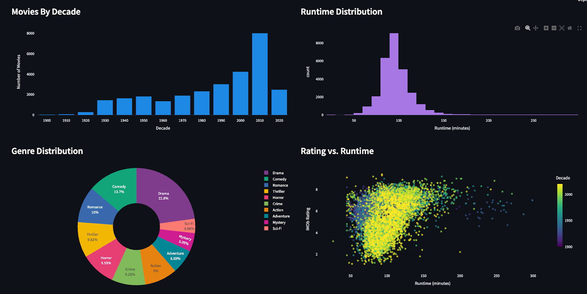
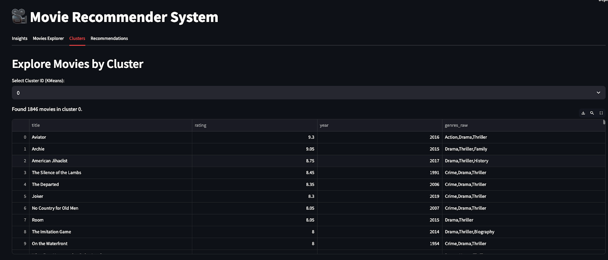
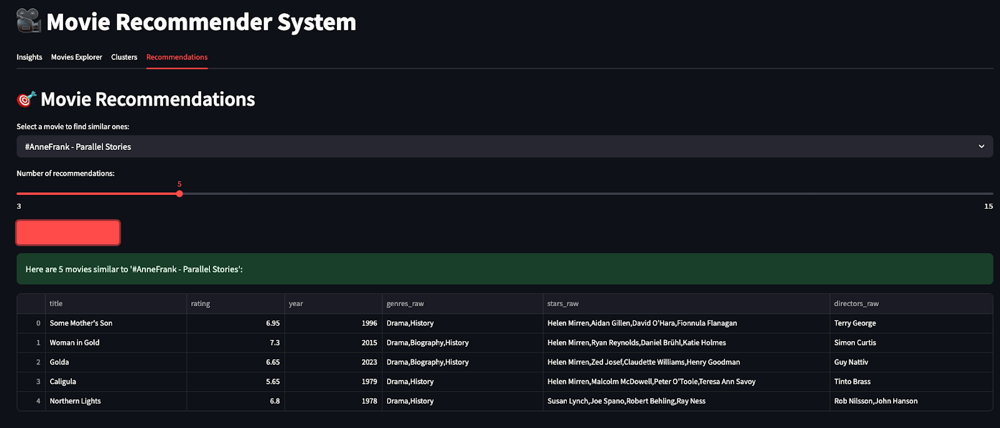

# 🎬 Movie Recommendation System

Welcome to the **Movie Recommendation System** project! This repository contains the code for a Data Science project focused on building a movie recommendation system using data analysis and visualization techniques.

---

## 🚀 Project Overview

The system is built on three datasets (detailed in the _"Milestone 1.pdf"_ report). The code in this repository processes these datasets to perform data analysis, generate insightful visualizations, and build a recommendation model.

To run the project, please review the key files listed below.

---

## Data Licenses

The datasets used in this project are obtained from publicly available and trustworthy sources. Each dataset adheres to its respective licensing agreements, as detailed below:

- **IMDB Dataset (by Genre)**  
  - **Source:** Kaggle / IMDB  
  - **License:** Licensed under [CC BY-NC-SA 4.0](https://creativecommons.org/licenses/by-nc-sa/4.0/)

- **MovieLens Dataset**  
  - **Source:** GroupLens Research  
  - **License:** Licensed under [CC BY 4.0](https://creativecommons.org/licenses/by/4.0/), allowing reuse with proper attribution.

- **TMDB 2023 Dataset**  
  - **Source:** Kaggle / TMDB  
  - **License:** Licensed under [Open Data Commons Attribution License (ODC-By) v1.0](https://opendatacommons.org/licenses/by/1-0/)

All datasets are used solely for academic purposes and have not been redistributed or modified beyond the scope of analysis within this project.

---

## 📁 Files Overview

1. **`.ipynb` Notebooks** – Contains all backend code including data sourcing, model training, and model evaluation.
    
2. **`Scripts/data_splits/`** – Located in the Google Drive link under the Data Files section. This folder stores the data splits used during model training.
    
3. **`Scripts/models/`** – Includes all trained models used in the project. Also available in the Google Drive link or can be regenerated using the guide under Running the Project.
    
4. **`Images/`** – Contains graphs generated during analysis. Saved for visual reference.
    
5. **`Report/`** – Includes milestone reports such as _"Milestone 1.pdf"_, which details the datasets and project scope.
    
6. **`Data/`** – Includes the data files used for the project. _(Note: Large files are not included in this repository due to size constraints.)_
    
7. **`m2_plots/`** and **`figures/`** – Contain plots generated during execution of the notebooks.
    

---

## 📦 Data Files

Due to file size limitations, some datasets are hosted externally. You can access them using the following links:

- 🔗 [Download Data Files](https://drive.google.com/drive/folders/1O3tv2h5cheKzi6Cub4i18PPCmK4Swqf_?usp=sharing)
    
- 🔗 [Download Full Project Setup](https://drive.google.com/file/d/1wzqzZpb1jELbKOT0IsuAu0NJ781c1tjG/view?usp=drive_link)

- 🔗 [Download Final Videos here](https://drive.google.com/drive/folders/1YWGyTX-V2161sxl2teLQnTrR8xQbHieV?usp=drive_link)

---

## ▶️ Running the Project

> ⚠️ It is recommended to set up a Conda environment and install the required dependencies before starting.

Launch the Jupyter notebooks using Anaconda Navigator or the terminal.

### Execution Steps:

1. **Run `Milestone1.ipynb`**  
    Loads and preprocesses the data, saving it in normalized format in the `/Data/` directory.
    
2. **Run `Milestone2.ipynb`**  
    Trains four models: Linear Regression, Logistic Regression, K-Nearest Neighbors, and XGBoost. Saves models in the `models/` folder.
    
3. **Run `Milestone2_v2.ipynb`**  
    Trains three additional models: KMeans, KNN, and HDBScan. These models and their respective features/labels are stored in nested directories inside `models/`.
    
4. **Run `Milestone3.ipynb`**  
    Tests and evaluates performance of all six distinct models (Linear Regresion was discarded and not tested on test data due to it's high MSE score insights).
    
5. **Launch the Web UI**  
    Execute the following command in your terminal:
    
   ``` bash
    streamlit run dashboard.py
   ```
    
    This will open the dashboard in your default web browser.
    

---

## 📚 Prerequisites

Make sure the following Python libraries are installed:

- `pandas`
    
- `numpy`
    
- `matplotlib`
    
- `sqlite`
    
- `seaborn`
    
- `scikit-learn`
    
- `plotly`
    
- `hdbscan`
    
- `streamlit`
    

Install via pip:

```bash
pip install pandas numpy matplotlib seaborn scikit-learn plotly hdbscan streamlit
```

> 🔍 If additional package errors occur, install the missing packages before rerunning the notebooks or app.

---

## 🖼️ UI Screenshots

### 📈 Insights

> Shows some general insights using plots for different features



### 🔍 Movies Explorer

> User can play with entire dataset using this tab


### 🕸️ Clusters

> Data Scientists can use this tab to view the different cluster groupings



### 🎯 Recommendations

> User can choose a movie which they like and they will get the recommendation using KNN.



---

## ⚙️ How to Run

- Download the dataset using the provided links.
    
- Place dataset files in the `/Data/` folder.
    
- Run the notebooks in milestone order.
    
- The analysis will generate and save plots in the `/Images/` directory.
